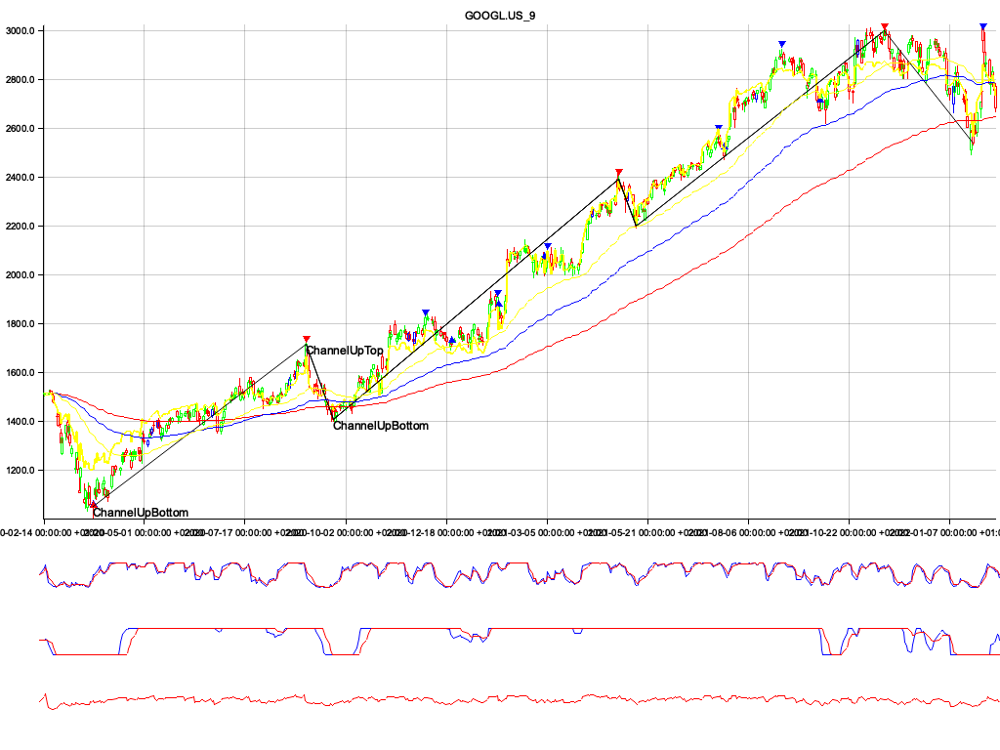

# rs-algo-scanner

## Rust algorithmic stock screener

Stock screener written in Rust. In this first iteration the idea is to construct just an screener that will help me to analyse the stock marked using Technical analysis. In a second iteration, this screener will be used by a bot to do algorithmic trading.

## Stack

The whole screener and it's backend is built in Rust and it was designed to run in Docker containers in a Kubernetes cluster, using Helm and Ansible for release deployments.

### Screener Status

- [x] Image output support
- [x] WebSocket support
- [] Side Backend for data processing
- [x] XTB broker implementation
  - [x] Get all available symbols
  - [x] Process a symbol
- [x] Indicators
  - [x] RSI
  - [x] Stoch
  - [x] MacD
  - [x] EMAS
- [x] Candlestick patterns identification
  - [x] Popular candlestick patterns implemented
  - [] Review formulas
- [ ] Chart pattern Identification
  - [x] Triangles
  - [x] Rectangles
  - [x] Double top & double bottom
  - [x] Channels
  - [x] Broadenings
  - [] Head & Shoulders
  - [] Divergences
  - [] Activated pattern
- [ ] Market regime filters

### Examples

:)
